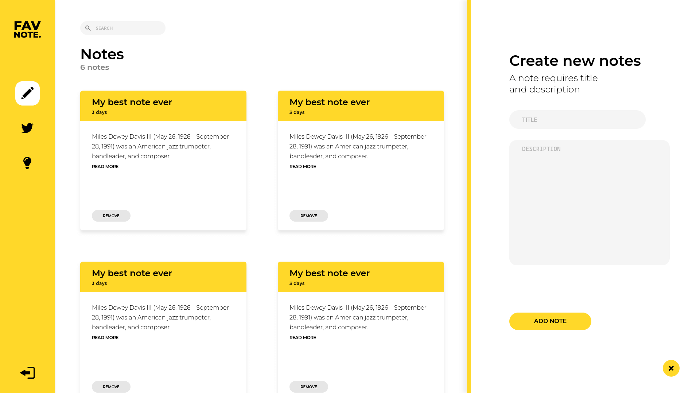
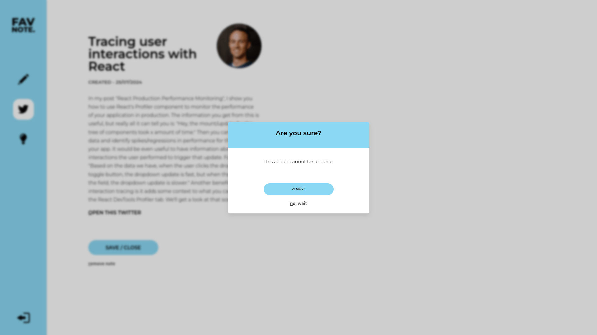

<h1 align="center">Manage your favorite notes with FavNote.</h1>

  
   
   
  <em>FavNote is a simple yet functional app for creating and managing various types of notes.</em>
   
   

## About the project

  
   
  
   

A simple yet very functional application that allows the creation of various types of notes, secure storage, and easy management. Additionally, the application features an elegant user interface that ensures a high-quality user experience.

### Used technologies

In the project I used the following libraries and tools:

- [React](https://react.dev/learn),
- [React Router](https://reactrouter.com/)
- [Redux Toolkit](https://redux-toolkit.js.org/introduction/getting-started)
- [Styled Components](https://styled-components.com/docs/basics#getting-started)
- [Typescript](https://www.typescriptlang.org/)
- [Formik](https://formik.org/) with [Yup](https://github.com/jquense/yup#yup)
- [ESLint](https://eslint.org/docs/user-guide/getting-started) and [Prettier](https://prettier.io/docs/en/index.html)
- [Husky](https://typicode.github.io/husky/#/) 6 with [lint-staged](https://github.com/okonet/lint-staged#-lint-staged----)
- [Firebase Authentication](https://firebase.google.com/docs/auth) and [Cloud Firestore](https://firebase.google.com/docs/firestore)
- [Storybook](https://storybook.js.org/docs)
- [React Testing Library](https://testing-library.com/docs/react-testing-library/intro/)
- [Jest](https://jestjs.io/docs/getting-started)

and more...

### Features

Currently, the application includes the following functionalities:

- [x] Ability to create, browse and delete few types of notes,
- [x] Details page for notes
- [x] Changing the interface color based on the type of notes
- [x] Displaying the number of notes for each type
- [x] Form validation (including handling server errors) with a focus on UX (clear error messages and disabling the submit button when the form contains errors)
- [x] User authentication and account system
- [x] Works on both desktop and mobile devices (Responsive Web Design)
- [x] Ability to search notes using a search box
- [x] Page title management

## Getting started

**Obsolete! Will be updated soon!**

Build using [NPM](https://www.npmjs.com/get-npm) scripts. The following scripts are available:

- `start` - starts the development server,
- `build` - bundles the app into static files for production,
- `test` - starts the test runner,
- `eject` - removes this CRA tool and copies build dependencies, configuration files
  and scripts into the app directory. **If you do this, you can’t go back!**,
- `storybook` - start the component explorer,
- `build-storybook` - bundles the component explorer,

## Acknowledgments

The following list contains acknowledgments for individuals and organizations who had a significant impact on the project:

- Adam Romański - for the project idea and permission to publicly use it in my repository, as well as for allowing the use of their application design.

## License

Licensed under the MIT License. See [LICENSE](./LICENSE) for more information.
